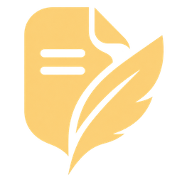
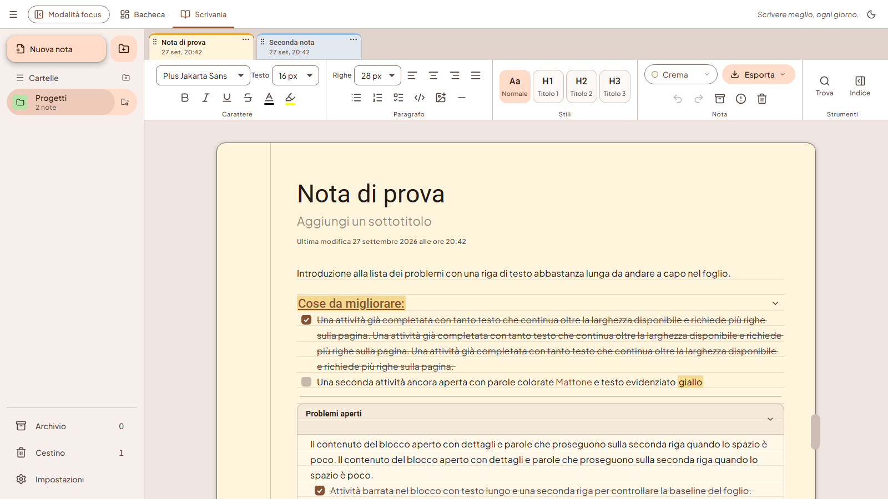
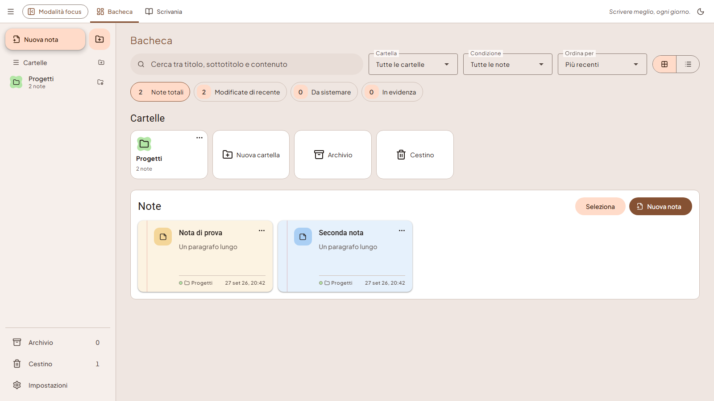
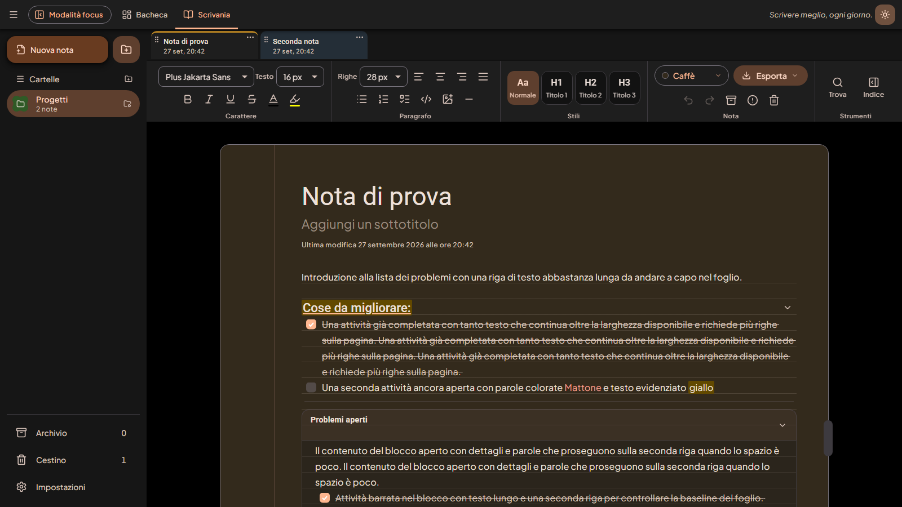
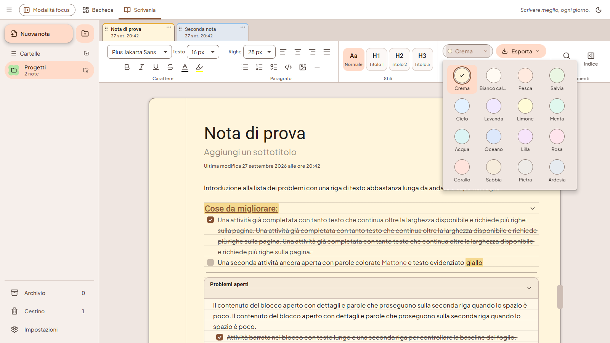
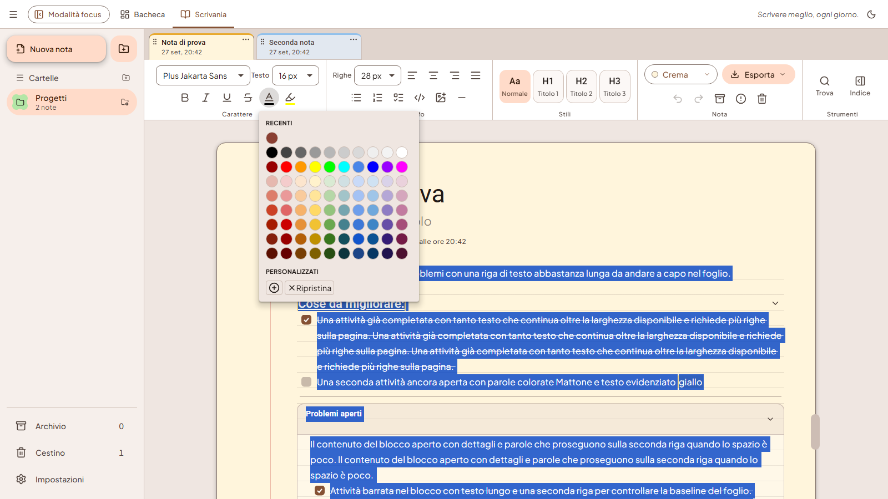
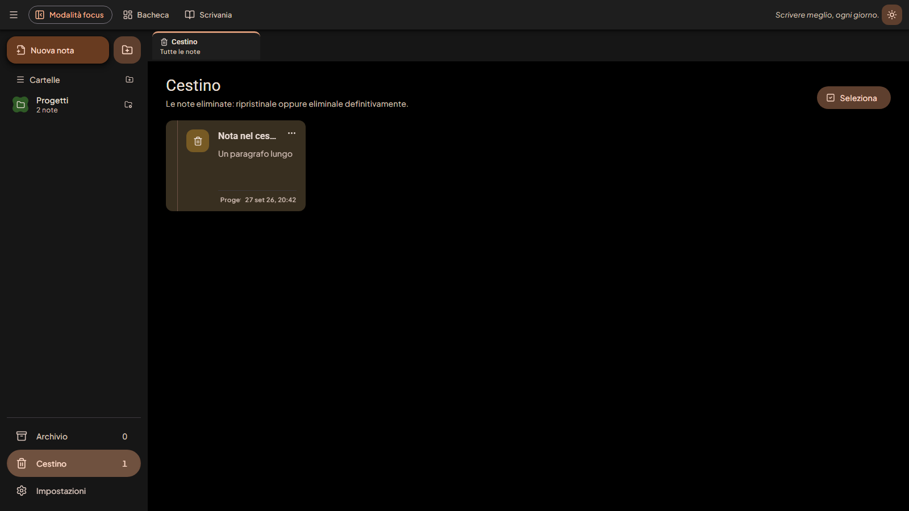

<div align="center">



# TypogNotes

**Write better, every day.**

A Windows desktop app for taking notes on ruled paper, sorting them into folders
and finding them again instantly. Everything stays on your computer: no account, no cloud.

[](https://github.com/zSimone35/TypogNotes/releases/latest)




</div>

> **Note:** the application interface is in Italian. Italian UI names are given in parentheses where they first appear.

## Table of contents

- [Features](#features)
- [Gallery](#gallery)
- [Installation](#installation)
- [How to use it](#how-to-use-it)
- [Your data](#your-data)
- [Development](#development)
- [Project structure](#project-structure)
- [Feedback](#feedback)
- [License](#license)

## Features

**Writing**
- Ruled paper with adjustable line spacing: headings, lists, checklists, code and images always stay aligned to the lines.
- H1–H3 headings with **collapsible sections**: the arrow to the right of a heading hides the content below it.
- Full formatting: font per selection, size, bold, italic, underline, strikethrough, alignment.
- **10×8 palette** for text and highlighter, custom colors and **recent colors for each note**.
- Code blocks with syntax highlighting (14 languages) and quick copy.
- **Images** (PNG, JPEG, WebP, GIF, BMP) from a button or with Ctrl+V, in 5 layouts: inline, wrap text, break text, behind or in front of the text.
- Horizontal dividers from 1 to 8 px thick (right-click the button or the line).
- Offline spell checking in Italian, English, French, Spanish and German, with a personal dictionary; it ignores code blocks.
- Find and replace (Ctrl+F) and a note outline generated from the headings.

**Organization**
- **Dashboard** (*Bacheca*) to browse folders and notes: search, filters, sorting, grid or list view, drag a note onto a folder to move it.
- **Tabs** for the notes in the current folder at the top of the Desk (*Scrivania*), reorderable by dragging or with the arrow keys.
- Pinned notes, notes flagged as "to fix", multi-select to move or delete.
- **Archive** (*Archivio*) and **Trash** (*Cestino*) as pages of their own: open a note read-only, restore it or delete it permanently.

**Look and feel**
- Material Design 3 interface with light and dark themes.
- 16 paper colors, with dedicated names in the dark theme.
- Focus mode, collapsible sidebar, resizable tool ribbon.

**Export**
- Markdown, HTML and PDF.

## Gallery

| Dashboard | Dark theme |
|---|---|
|  |  |
| **Paper colors** | **Text and highlighter palette** |
|  |  |
| **Trash** | |
|  | |

## Installation

1. Download `TypogNotes_x.y.z_x64-setup.exe` from the [latest release](https://github.com/zSimone35/TypogNotes/releases/latest).
2. Run the installer and follow the steps. No administrator rights are needed: the app is installed for the current user.
3. Open TypogNotes from the Start menu.

Requirements: 64-bit Windows 10 or 11 with Microsoft Edge WebView2, already present on up-to-date systems.

> The installer is not digitally signed: on first launch Windows SmartScreen may show a warning. Choose **More info › Run anyway**.

## How to use it

| Action | How |
|---|---|
| New note or new folder | Buttons at the top of the sidebar |
| Switch between notes | Tabs at the top of the Desk |
| Collapse a section | Arrow to the right of an H1, H2 or H3 heading |
| Change the paper color | Ribbon › Note › color menu |
| Insert an image | Image button in the ribbon, or Ctrl+V |
| Image layout | Right-click the image |
| Quick formatting, recent colors, corrections | Right-click in the text |
| Checkbox shape | Right-click the Checklist button |
| Find and replace | Ctrl+F |
| Archive, move or pin a note | ⋯ menu or right-click the tab |

Saving is automatic: if it fails, a warning appears at the top right.

## Your data

Notes are stored in a SQLite database in the local Windows data folder
(`%LOCALAPPDATA%\com.typognotes.app`). No content is sent over the network.
Images are kept in the same database, together with the note that contains them.

## Development

**Prerequisites**
- Node.js 22 or later
- Rust stable with the `stable-msvc` toolchain
- Visual Studio Build Tools with the "Desktop development with C++" workload
- Microsoft Edge WebView2

```powershell
npm install
npm run tauri dev        # app in development
npm run tauri build      # NSIS installer in src-tauri/target/release/bundle/nsis
```

**Verification**

```powershell
npm run build                                       # type-check and frontend build
cargo test --manifest-path src-tauri/Cargo.toml     # backend tests
npm run test:e2e                                    # UI tests (Playwright)
```

The UI tests run in the browser with a mock backend (`e2e/tauri-mock.ts`), so you do not need to compile Rust to run them.

## Project structure

```
src/                    React + TypeScript interface
  components/           Desk, Dashboard, ribbon, menus, dialogs
  editor/               Tiptap extensions: images, sections, lines, spell checking
  ui/                   Material shapes, menu positioning, recent colors
  styles/global.css     light and dark Material Design 3 theme
src-tauri/              Rust backend (Tauri 2)
  src/                  commands, database, note validation, export
  migrations/           versioned SQLite schema
  windows/              NSIS installer templates and images
e2e/                    Playwright tests
scripts/                installer images and Material shape generation
```

## Feedback

Your feedback helps improve TypogNotes:

- 💬 **[Discussions](https://github.com/zSimone35/TypogNotes/discussions)**: comments, questions, opinions and ideas to talk about.
- 🐞 **[Report a problem](https://github.com/zSimone35/TypogNotes/issues/new?template=bug.yml)**: something is not working.
- 💡 **[Suggest an idea](https://github.com/zSimone35/TypogNotes/issues/new?template=idea.yml)**: a new feature or an improvement.

A (free) GitHub account is required.

## License

Released under the [MIT](LICENSE) license. The Material shapes in `scripts/vendor/` are derived
from AndroidX (Apache-2.0, see [`scripts/vendor/LICENSE`](scripts/vendor/LICENSE)).
